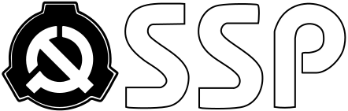



### 警告：

**高度机密**
严禁未经授权的人员进行访问




人类到如今已经繁衍了 25000 年，只有最近的 4000 年是有意义的。


> 所以，我们在将近 25000 年中在干嘛？我们躲在山洞中，围坐在小小的篝火边，畏惧那些我们不懂得的事物——那些关于太阳如何升起的解释，那些人头鸟身的怪物，那些有生命的石头。所以我们称他们为“神”和“恶魔”，并向他们祈求宽恕和祈祷拯救。\
> 之后，他们的数量在减少，我们的数量在增加。当我们恐惧的事物越来越少，我们开始更理智的看待这个世界。然而，不能解释的事物并没有消失，好像宇宙故意要表现出荒谬与不可思议一样。\
> 人类不能再生活在恐惧中。没有东西能保护我们，我们必须保护我们自己。”

—— The Administrator

于是，基金会出现了。

SSP 基金会（英文名：SSP Foundation）全称特殊收容措施基金会（英文名：Special Suppression Procedures Foundation）。

> “当其他人在阳光下生活时，我们必须在阴影中和它们战斗，并防止它们暴露在大众眼中，这样其他人才能生活在一个理智的，普通的世界中。\
> 我们控制，我们收容，我们保护。”

—— The Administrator

基金会于世界各地的暗处活动，其本身运作不受各个主要国家政府的司法管辖权、授权和委托的干扰。基金会目标为收容世界上的异常现象、事件、个体等等，并统称为“收容物”（即 SSP）。每个收容物都会有一个对应的编号（如 SSP–9652）。许多这些“物品”既可对人产生物理危险，又可对世界范围的人群产生心理影响，动摇他们的个人信念，干扰他们的日常生活。

基金会维持常态，从而使世界各地的平民得以生存并避免陷入恐惧、猜忌或失去信念的境况之中，并从地外、异次元和外层空间的威胁中维持人类的独立自主。

我们的任务有三方面：

- 控制

基金会控制异常以防止它们落入平民或敌对组织手中，透过广泛观察及监测并采取行动尽早拦截它们。

- 收容

基金会收容异常以防止它们的影响或效应散播，通过迁移、掩饰、拆除它们或是通过抑制或阻止公众传播它们的知识的方式进行。

- 保护

基金会保护人类免受异常的影响并保护异常本身直至它们被完全理解以及出现自它们的特性及行为上制定的新科学定理为止。如果异常被收容时被判定为过度危险，基金会或也会以将异常无效化或摧毁作为最后手段。
